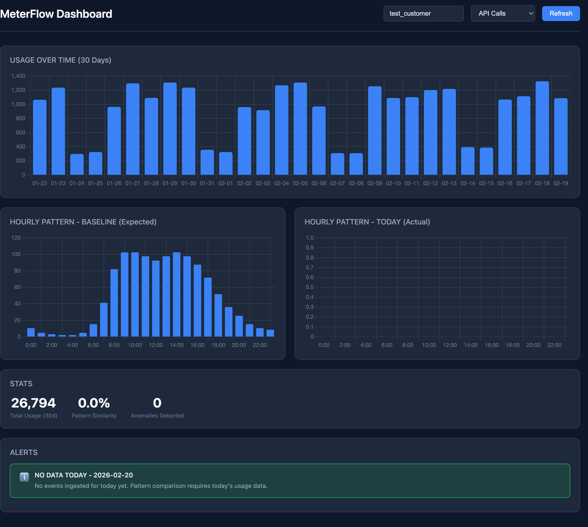
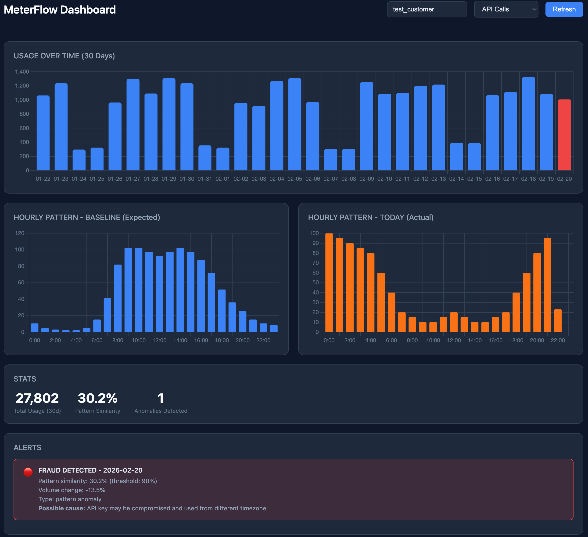

# MeterFlow

A usage-based billing engine that handles the full lifecycle: event ingestion, deduplication, storage, aggregation, fraud detection, pricing, and Stripe billing integration.

> **New here?** Read the [System Walkthrough](docs/SYSTEM_WALKTHROUGH.md) — a real-world narrative that follows a customer from their first API call to their monthly invoice. It explains every component with concrete scenarios and implementation details.

## Architecture

```
┌──────────┐     ┌──────────────────────────────────────────────────────┐
│  Client  │────▶│                    API Layer (Fastify)               │
│          │     │                                                      │
│          │     │  ┌────────────┐  ┌─────────────┐  ┌──────────────┐  │
│          │     │  │ Auth Hook  │─▶│ Rate Limit  │─▶│ Route Handler│  │
│          │     │  │ (API Key)  │  │ (Sliding    │  │              │  │
│          │     │  │            │  │  Window)    │  │              │  │
│          │     │  └────────────┘  └─────────────┘  └──────┬───────┘  │
│          │     │                                          │          │
│          │◀────│  Response with rate limit headers         │          │
└──────────┘     └──────────────────────────────────────────┼──────────┘
                                                            │
                     ┌──────────────────────────────────────┤
                     │              │              │         │
                     ▼              ▼              ▼         ▼
              ┌───────────┐  ┌───────────┐  ┌─────────┐  ┌─────────┐
              │   Redis   │  │ ClickHouse│  │  MinIO  │  │  Stripe │
              │           │  │           │  │  (S3)   │  │ (Billing│
              │ • Dedup   │  │ • Events  │  │ • Raw   │  │  dry-run│
              │ • API Keys│  │ • Usage   │  │   JSON  │  │  in demo│
              │ • Rate    │  │   queries │  │   backup│  │  mode)  │
              │   limits  │  │ • Anomaly │  │         │  │         │
              │ • Fraud   │  │   data    │  │         │  │         │
              │   baseline│  │           │  │         │  │         │
              └───────────┘  └───────────┘  └─────────┘  └─────────┘
```

## Features

| Feature | Description |
|---------|-------------|
| **Event Ingestion** | `POST /v1/events` — batch support (up to 1000), schema + business validation |
| **Deduplication** | Redis `SET NX` with 30-day TTL, pipelined batch operations |
| **Storage** | ClickHouse MergeTree ordered by (customer, event_type, timestamp) |
| **Backup** | MinIO raw JSON at `events/YYYY/MM/DD/batch_{ts}_{rand}.json` |
| **API Authentication** | API key auth via Redis, customer-scoped access, admin key management |
| **Rate Limiting** | Redis sorted set sliding window (avoids fixed-window boundary problem) |
| **Usage Aggregation** | Billable metrics catalog (COUNT, SUM, MAX) with group_by support |
| **Anomaly Detection** | Z-score against 30-day baseline, severity levels (normal/warning/critical) |
| **Fraud Detection** | 24-dim hourly vectors, cosine similarity, per-weekday baselines |
| **Pricing Engine** | Flat + tiered pricing, 4 billable metrics |
| **Invoice Calculation** | Usage x pricing = line items with tier breakdowns |
| **Stripe Billing** | Dry-run billing cycle that builds real Stripe SDK payloads |
| **Dashboard** | Chart.js visualizations, fraud alerts, pattern comparison |

## Tech Stack

- **Runtime:** Node.js + TypeScript
- **API Framework:** Fastify with TypeBox validation
- **Dedup / Auth / Rate Limiting / Baselines:** Redis
- **Event Storage & Analytics:** ClickHouse (columnar)
- **Backup:** MinIO (S3-compatible)
- **Containers:** Docker Compose

## Getting Started

### Prerequisites

- Node.js 18+
- pnpm
- Docker & Docker Compose

### Setup

```bash
pnpm install
docker compose up -d
pnpm dev
```

### Quick Test

```bash
# Health check
curl http://localhost:3000/health

# Provision an API key
curl -X POST http://localhost:3000/v1/admin/keys \
  -H "Content-Type: application/json" \
  -d '{"customer_id": "acme_corp", "name": "test"}'
# → {"api_key": "mf_...", "customer_id": "acme_corp", ...}

# Ingest an event
curl -X POST http://localhost:3000/v1/events \
  -H "Content-Type: application/json" \
  -H "X-API-Key: mf_..." \
  -d '{
    "events": [{
      "transaction_id": "txn_001",
      "customer_id": "acme_corp",
      "event_type": "api_request",
      "timestamp": '"$(date +%s000)"',
      "properties": {"endpoint": "/users", "bytes": 2048}
    }]
  }'
# → {"accepted": 1, "duplicates": 0, "failed": []}
```

### Run Validation Tests

```bash
pnpm validate    # 60 checks: auth, rate limits, ingestion, dedup, usage, anomaly, pricing, invoicing, billing, fraud
```

## Fraud Detection Demo

This demo simulates a stolen API key scenario. The attacker makes the same number of calls per day (to avoid volume-based detection) but from a different timezone — so the hourly pattern is completely different.

**Normal usage** — 30 days of business-hours traffic. Baseline shows the expected 9am–5pm bell curve:



**After injecting fraudulent events** — the attacker's night-time pattern (orange) is the inverse of the baseline. Cosine similarity drops to 30.2% (threshold: 90%), triggering a fraud alert:



### Run the demo yourself

```bash
# 1. Start fresh
pnpm demo:reset

# 2. Generate 30 days of normal business-hours usage
pnpm simulate:history

# 3. Build per-weekday baselines from the history
curl -X POST localhost:3000/v1/fraud/baselines/build \
  -H "Content-Type: application/json" \
  -d '{"customer_id": "test_customer", "metric": "api_calls", "days": 30}'

# 4. Open the dashboard — shows normal pattern
open http://localhost:3000/dashboard/

# 5. Inject fraudulent night-time events (simulates stolen key from different timezone)
pnpm simulate:fraud

# 6. Refresh dashboard — shows FRAUD DETECTED with ~30% similarity
```

## API Reference

All endpoints except public routes require an `X-API-Key` header.

### Public Routes (no auth required)

| Method | Endpoint | Description |
|--------|----------|-------------|
| GET | `/health` | Health check |
| GET | `/v1/metrics` | List billable metrics catalog |
| GET | `/v1/pricing` | List all pricing rules |
| GET | `/v1/pricing/:metric_code` | Get pricing for a specific metric |
| GET | `/dashboard/` | Fraud detection dashboard |

### Admin Routes (open for demo, would require admin auth in production)

| Method | Endpoint | Description |
|--------|----------|-------------|
| POST | `/v1/admin/keys` | Provision an API key |
| POST | `/v1/admin/keys/revoke` | Revoke an API key |

### Authenticated Routes (require `X-API-Key`)

| Method | Endpoint | Description |
|--------|----------|-------------|
| POST | `/v1/events` | Ingest batch of usage events |
| GET | `/v1/usage` | Query aggregated usage (with optional group_by) |
| GET | `/v1/anomalies/check` | Check for Z-score anomalies |
| GET | `/v1/fraud/check` | Check for pattern-based fraud |
| POST | `/v1/fraud/baselines/build` | Build fraud detection baselines |
| POST | `/v1/invoices/calculate` | Calculate invoice for a billing period |
| POST | `/v1/billing/run` | Run billing cycle with Stripe dry-run |
| GET | `/v1/dashboard/data` | Dashboard visualization data |

### Rate Limit Headers

Every authenticated response includes:

```
X-RateLimit-Limit: 100
X-RateLimit-Remaining: 87
X-RateLimit-Reset: 60
```

## Event Schema

| Field | Type | Description |
|-------|------|-------------|
| `transaction_id` | string | Unique ID for idempotency |
| `customer_id` | string | Customer identifier |
| `event_type` | string | Event category (`api_request`, `storage`, `compute`) |
| `timestamp` | number | Unix epoch milliseconds |
| `properties` | object | Flexible key-value data for billing metrics |

## Project Structure

```
src/
├── api/
│   ├── server.ts          # Fastify server, all routes
│   ├── schemas.ts         # TypeBox request/response schemas
│   ├── validation.ts      # Business validation rules
│   └── hooks/
│       ├── authenticate.ts  # API key auth + customer scoping
│       └── ratelimit.ts     # Sliding window rate limiter
├── config/
│   ├── redis.ts           # Redis client
│   ├── clickhouse.ts      # ClickHouse client + table init
│   ├── minio.ts           # MinIO (S3) client
│   ├── auth.ts            # Auth constants, public routes
│   ├── metrics.ts         # Billable metrics catalog
│   └── pricing.ts         # Pricing rules (flat + tiered)
├── utils/
│   ├── dedup.ts           # Redis SET NX deduplication
│   ├── storage.ts         # ClickHouse insert + query
│   ├── backup.ts          # MinIO raw JSON backup
│   ├── auth.ts            # API key CRUD (Redis)
│   ├── ratelimit.ts       # Sorted set sliding window
│   ├── usage.ts           # Metric aggregation queries
│   ├── anomaly.ts         # Z-score anomaly detection
│   ├── invoice.ts         # Invoice calculation (tiered pricing)
│   ├── billing.ts         # Billing cycle runner
│   ├── stripe.ts          # Stripe payload builder (dry-run)
│   └── fraud/
│       ├── vectors.ts     # 24-dim hourly vectors, cosine similarity
│       ├── baseline.ts    # Per-weekday baseline storage (Redis)
│       └── detection.ts   # Pattern + volume fraud detection
├── dashboard/
│   └── index.html         # Chart.js fraud detection dashboard
└── types/                 # TypeScript interfaces

scripts/
├── validate.ts            # E2E validation (60 checks)
├── simulate-history.ts    # Generate 30 days of normal usage
├── simulate-fraud.ts      # Inject night-time fraud pattern
├── demo-reset.ts          # Clean slate (truncate ClickHouse, flush Redis)
└── provision-key.ts       # CLI: provision an API key

docs/
├── SYSTEM_WALKTHROUGH.md  # Real-world narrative of every component
└── PRODUCTION_CONSIDERATIONS.md  # Production architecture notes
```

## Infrastructure

| Service | Port | Purpose |
|---------|------|---------|
| MeterFlow API | 3000 | All endpoints + dashboard |
| Redis | 6379 | Dedup, auth, rate limits, baselines |
| RedisInsight | 8001 | Redis UI |
| ClickHouse | 8123 | Event storage + analytics |
| MinIO API | 9002 | S3-compatible backup |
| MinIO Console | 9003 | MinIO UI |

## Documentation

- **[System Walkthrough](docs/SYSTEM_WALKTHROUGH.md)** — Real-world narrative explaining every component through the story of a customer's lifecycle. Start here to understand the system.
- **[Production Considerations](docs/PRODUCTION_CONSIDERATIONS.md)** — How each component would change for production: AWS services, scaling considerations, and architecture patterns.

## License

MIT
